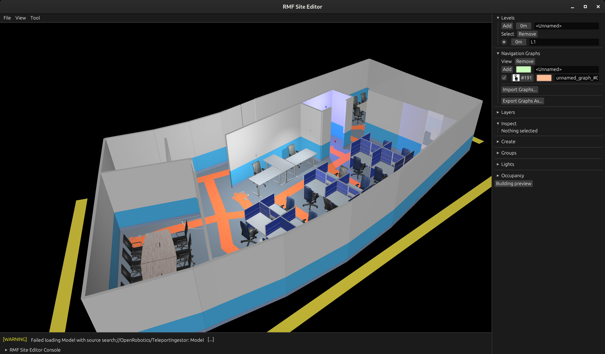

[](https://github.com/open-rmf/rmf_site/actions/workflows/style.yaml)
[](https://github.com/open-rmf/rmf_site/actions/workflows/ci_linux.yaml)
[](https://github.com/open-rmf/rmf_site/actions/workflows/ci_web.yaml)
[](https://github.com/open-rmf/rmf_site/actions/workflows/ci_windows.yaml)

# The RMF Site Editor



The RMF Site Editor is an experimental approach to visualizing and editing large RMF deployment sites.
It is built in Rust using [Bevy](https://bevyengine.org/), an open-source Rust-based game engine.

Rust and Bevy allow The RMF Site Editor to target both desktop (Windows/Linux/Mac) and web (WebAssembly+WebGL/WebGPU) using the same codebase:
 * Web build: the browser application provides maximum convenience, since there is nothing to build or install.
 * Desktop build: maximum performance, thanks to multithreading and lower-level GPU integration.

[Click here to use the web build in your browser](https://open-rmf.github.io/rmf_site/).

# Project Integration

To use the Site Editor in an Open-RMF project to configure a simulation or deployment,
follow the instructions at [`rmf_site_ros2`](https://github.com/open-rmf/rmf_site_ros2).
There you will find `rmf_site_cmake` which you can use to generate simulations and
navigation graphs from a Site Editor project, and `rmf_site_demos` which shows how to
set up a cmake project to build and launch your sites.

# Helpful Links

 * [Bevy Engine](https://bevyengine.org/)
 * [Bevy Cheat Book](https://bevy-cheatbook.github.io/)
 * [Rust Book](https://doc.rust-lang.org/stable/book/)

# Install dependencies (Ubuntu 20.04)

We need a newer Rust than what comes with Ubuntu 20.04.

First make sure you don't have any distro-installed Rust stuff on your machine:
```bash
$ sudo apt remove rustc cargo
```

If you don't have it already, install `rustup` from the Rust website: https://www.rust-lang.org/tools/install
```bash
$ curl --proto '=https' --tlsv1.2 -sSf https://sh.rustup.rs | sh
```
Just select the normal defaults (option 1).
A bunch of stuff will happen. Be sure to close and re-open your terminal afterwards, so that it gets all the new stuff.

Alternatively, if you already have a Rust installation managed by `rustup`, you can just do this to bring it up-to-date: `rustup update`

Finally, we need some library packages:
```bash
$ sudo apt install libgtk-3-dev libasound2-dev libudev-dev
```

# Install dependencies (Windows 11)

Make sure you install rust from the main rust website. Cargo should take care of the rest of the magic for you.

⚠️ Note: If you are building inside of a Windows Subsystem for Linux (WSL) environment, you should follow the Ubuntu instructions. We do not have build instructions for other choices of Linux distros inside of WSL.

# Install extra dependencies for WebAssembly

These are only needed if you're going to build a WebAssembly binary:
```bash
$ cargo install -f wasm-bindgen-cli --version 0.2.100
$ cargo install basic-http-server
$ rustup target add wasm32-unknown-unknown

# binaryen version >= 110 required for a bug fix for wasm-opt
# Refer to https://github.com/emilk/egui/pull/6848
$ wget -P ~/ https://github.com/WebAssembly/binaryen/releases/download/version_123/binaryen-version_123-x86_64-linux.tar.gz
$ tar xf ~/binaryen-version_123-x86_64-linux.tar.gz -C ~/
$ export PATH=$PATH:~/binaryen-version_123/bin
```

# Build and Run (Desktop)

Currently tested on Ubuntu 20.04.4 LTS and windows 11.

From the root directory:

```bash
$ cargo run
```

Use the `--features bevy/dynamic_linking` flag to improve compile time through dynamic linking.
Use the `--release` flag for better runtime performance.

# Build and Run (WebAssembly)

TODO: The web assembly version is highly experimental, currently it lacks important features like
saving/loading of map files.

```bash
$ scripts/build-web.sh
$ scripts/serve-web.sh
```

Then use your favorite web browser to visit `http://localhost:1234`
